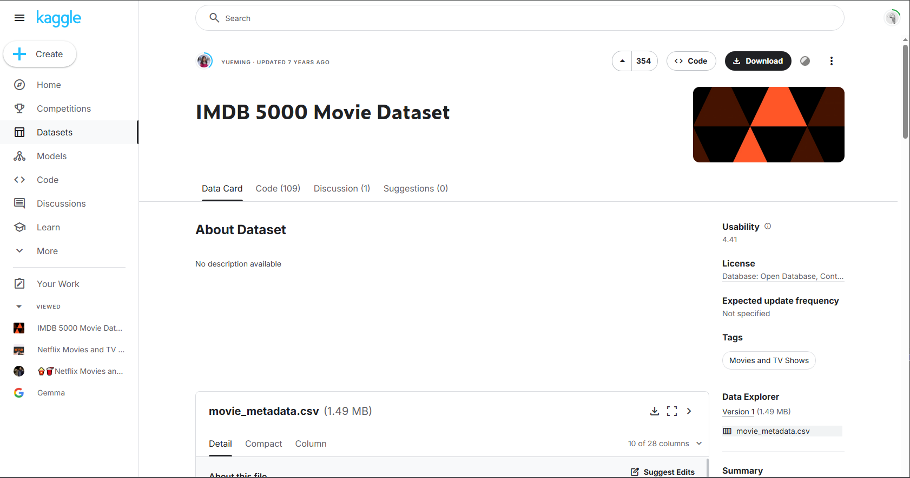
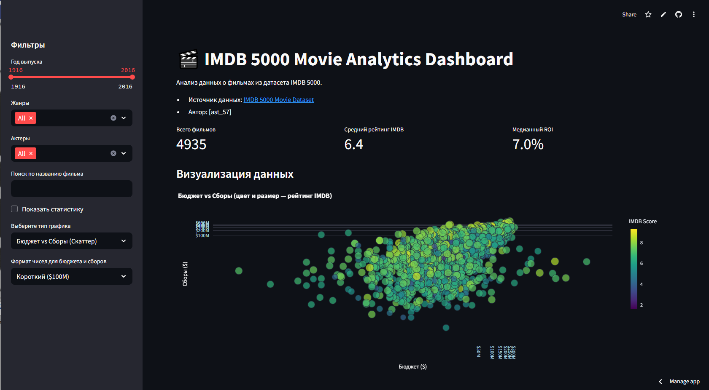

imdb-5000
Приложение Streamlit для анализа фильмов IMDB 5000

Панель мониторинга анализа фильмов IMDB
Интерактивный дашборд для анализа данных о фильмах из датасета IMDB 5000, построенный с помощью Streamlit.

Особенности
Фильтрация по жанрам, актерам, году выпуска и поиск по названию фильма.
Интерактивная таблица с отфильтрованными данными.
Визуализация зависимости бюджета и сборов, а также распределения рейтингов IMDB.
Метрики: количество фильмов, средний рейтинг, ROI.
Экспорт отфильтрованных данных в CSV.
Адаптивный интерфейс.

Датасет
Источник: [IMDB 5000 Movie Dataset](https://www.kaggle.com/datasets/carolzhangdc/imdb-5000-movie-dataset?resource=download)

